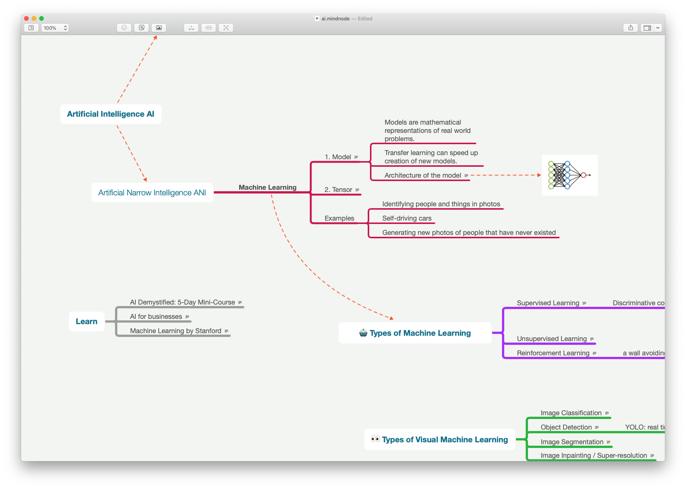

# Machine Learning With JavaScript



Explore [the complete mindmap](https://my.mindnode.com/h85zxxubxjuSewNvxwdhA3Ef32CpFeM7J8b4ML3z#-609.7,-24.7,2)

## Projects

Build with

```
cp -r tensorflowjs-template new
```

1. [mobilenet](mobilenet/)
1. [nsfwjs](nsfwjs/)
1. [joker-face](joker-face/)
1. [image-to-tensor](image-to-tensor/)
1. [tensor-reversal](tensor-reversal/)
1. [old-tv](old-tv/)
1. [vision](vision/)

## Ressources

- [The TensorFlow.js gallery](https://github.com/tensorflow/tfjs/blob/master/GALLERY.md)
- [Awesome TensorFlow.js](https://github.com/aaronhma/awesome-tensorflow-js)
- [IA Vision - Google Cloud](https://cloud.google.com/vision)
